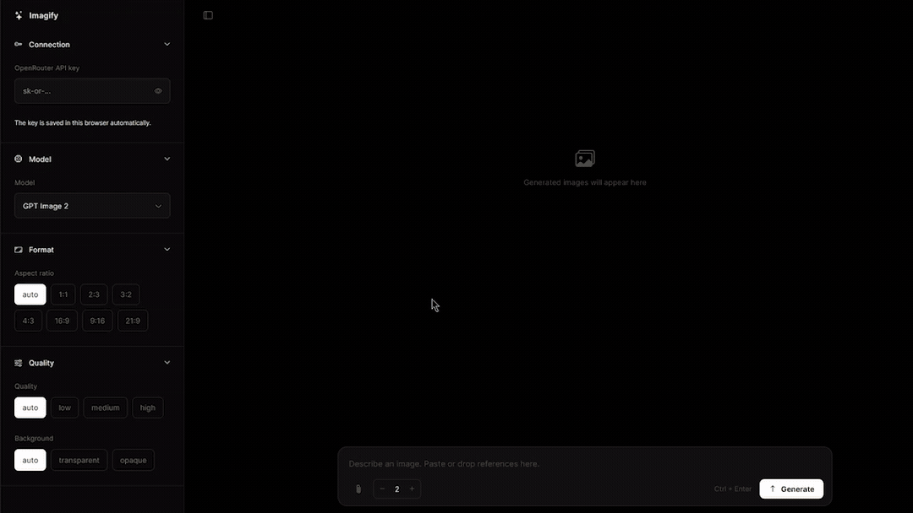

<h1 align="center">
Imagify OpenRouter
</h1>

<p align="center">
<a href="https://illoprin.github.io/imagify-openrouter/" >[Live 🔗]</a>
</p>

A lightweight TypeScript client for generating images via [OpenRouter](https://openrouter.ai), bundled with Vite.


The app runs entirely in your browser; requests go directly to OpenRouter. Vite is used for local development and production builds.





## Features

- Models: GPT Image 2, GPT Image 2.5 Sunburst, Nano Banana 2, Qwen Image 3 / 3 Pro
- Per-model settings: aspect ratio, quality, background, resolution, streaming
- Reference images: attach, drag-drop or paste
- Batch generation: up to 8 images in parallel
- Settings and image history persist in IndexedDB
- API key persists in browser localStorage


## Usage

1. Install dependencies and start Vite:
```bash
npm install
npm run dev
```
2. Enter your OpenRouter API key. It is saved automatically in this browser and remains available after reloads.

3. Type a prompt and press **Generate** (or `Ctrl + Enter`).

Run `npm run build` to create a production build in `dist/`.

## Privacy

App settings, references and generated image history are stored in IndexedDB. The API key is stored unencrypted in localStorage so it persists across reloads. Anyone with access to this browser profile, or scripts running on this page, can access it. Use this only on a trusted device and do not enter your key on an untrusted site.

## Reason

I built it because **I couldn't find a decent client**. They either require Docker or are overloaded with features I don't need. This one is single page and modern (Q3 2026) OpenRouter JSON configuration.