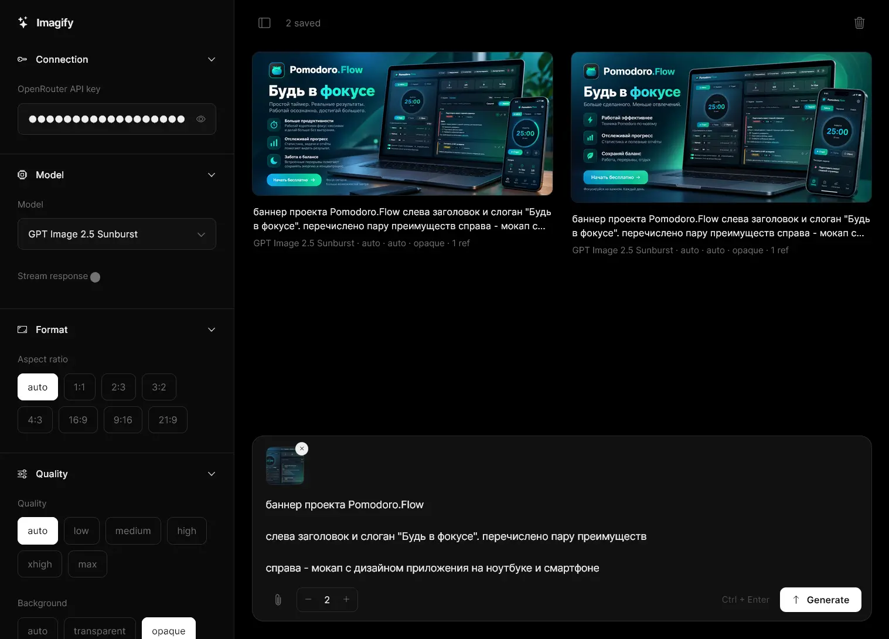

# Imagify OpenRouter

A minimal, single-file client for generating images via [OpenRouter](https://openrouter.ai).



I built it because I couldn't find a decent client. They either require Docker or are overloaded with features I don't need. This one is one HTML file: no build step, no backend, no install.


**Live:** https://illoprin.github.io/imagify-openrouter/

## Features

- Models: GPT Image 2, GPT Image 2.5 Sunburst, Nano Banana 2, Qwen Image 3 / 3 Pro
- Per-model settings: aspect ratio, quality, background, resolution, streaming
- Reference images: attach, drag-drop or paste
- Batch generation: up to 8 images in parallel
- History, settings and API key persist in `localStorage`

## Usage

1. Open the live page, or download `index.html` and run http server from root directory
```bash
npx http-server . -p 8080
```
2. Paste your OpenRouter API key in the side panel.
3. Type a prompt and press **Generate** (or `Ctrl + Enter`).

## Privacy

Everything runs in your browser. Requests go directly to OpenRouter. Your API key is stored in `localStorage` on your device only.

## Plans

Later I will add the ability to add your own models